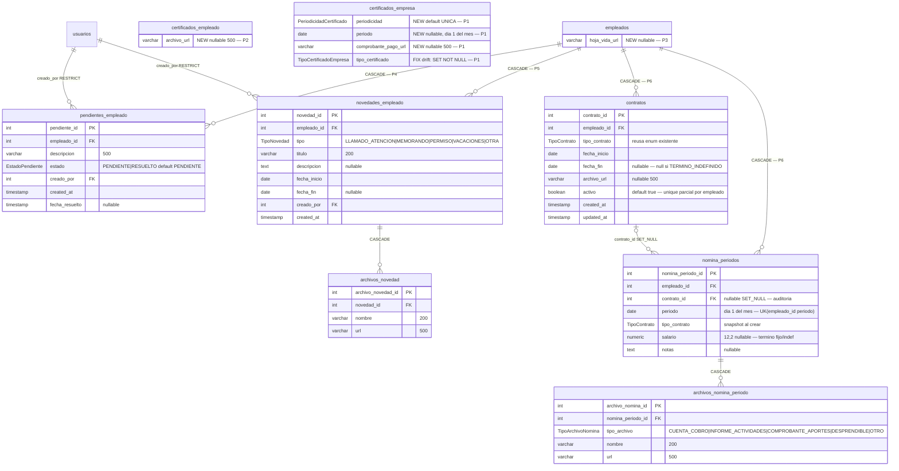

# Jul-4 Improvements — DB Schema Design (current → target)

**Date**: 2026-07-05
**Parent plan**: `jul-4-improvements-plan.md`
**Source of truth validated**: `backend/prisma/schema.prisma` @ migration `20260704173358_f2_cert_empleado_generic` vs live docker postgres `miempresa_dev` :15432

---

## 1. Current DB — validation result (live introspection 2026-07-05)

| Check | Result |
|---|---|
| Tables (28 models + `_prisma_migrations`) | ✅ Match — incl. `certificados_empleado` (new P4), old `certificados_alturas`/`certificados_riesgo_electrico` dropped |
| Enums (25) | ✅ Match — `TipoCertificadoEmpresa` (6 new values), `TipoVivienda` (PROPIA/ARRENDADA/FAMILIAR), `TipoCertificadoEmpleado` (4 values) |
| Foreign keys (31, with delete rules) | ✅ Match schema.prisma relations exactly |
| `cargos.salario` numeric(12,2) nullable | ✅ Present (P3) |
| Migration history | ✅ Clean — duplicate `f2_cert_empleado_generic` record is a properly rolled-back retry (benign) |
| **DRIFT-1** `certificados_empresa.tipo_certificado` | ⚠ **Nullable in DB, required in Prisma** — artifact of the temp-column enum migration. 0 NULL rows in 18 certs → fix with `SET NOT NULL` in jul4 P1 migration |

### Current ER diagram (validated against live DB)

```mermaid
erDiagram
    %% ===== AUTH =====
    usuarios ||--o{ sesiones : "usuario_id CASCADE"
    empleados |o--o{ usuarios : "empleado_id SET_NULL"

    %% ===== EMPLEADOS (hub) =====
    empleados ||--o{ nucleos_familiares : "CASCADE"
    empleados ||--o{ contactos_emergencia_empleados : "CASCADE"
    empleados ||--o{ cargos : "CASCADE"
    empleados ||--o{ experiencias_laborales_externas : "CASCADE"
    empleados ||--o{ educacion_idiomas : "CASCADE"
    empleados ||--o{ vehiculos : "CASCADE"
    empleados ||--o{ certificados_empleado : "CASCADE"
    empleados ||--o| datos_migracion : "CASCADE"

    %% ===== NOMINA LEGACY (schema-only, sin API/UI — dormida) =====
    empleados ||--o{ nominas : "CASCADE"
    nominas ||--o{ deducciones_salario : "CASCADE"
    nominas ||--o{ beneficios : "CASCADE"
    nominas ||--o{ comprobantes_pago : "CASCADE"

    %% ===== TIEMPO LEGACY (schema-only — dormida) =====
    empleados ||--o{ gestion_tiempo_vacaciones : "CASCADE"
    empleados ||--o{ ausentismos : "CASCADE"

    %% ===== CLIENTES =====
    clientes ||--o{ contactos_emergencia_clientes : "CASCADE"
    clientes ||--o{ registros_fichas_completadas : "CASCADE"
    clientes ||--o{ notas_clientes : "CASCADE"
    clientes ||--o{ prefacturas : "CASCADE"
    instrumentos ||--o{ registros_fichas_completadas : "RESTRICT"
    registros_fichas_completadas |o--o{ notas_clientes : "SET_NULL"
    usuarios ||--o{ notas_clientes : "autor RESTRICT"
    usuarios ||--o{ instrumentos : "creado_por RESTRICT"

    %% ===== EMPRESA =====
    empresas ||--o{ certificados_empresa : "CASCADE"
    usuarios ||--o{ certificados_empresa : "creado_por RESTRICT"

    %% ===== FINANZAS =====
    centros_costos ||--o{ productos_servicios : "CASCADE"
    centros_costos ||--o{ egresos : "CASCADE"
    productos_servicios ||--o{ prefacturas : "RESTRICT"

    certificados_empleado {
        int cert_empleado_id PK
        int empleado_id FK
        TipoCertificadoEmpleado tipo "ALTURAS|RIESGO_ELECTRICO|MANIPULACION_ALIMENTOS|OTRO"
        varchar nombre "nullable, requerido UI si OTRO"
        date fecha_expedicion
        date fecha_vencimiento
    }
    certificados_empresa {
        int cert_empresa_id PK
        int empresa_id FK
        TipoCertificadoEmpresa tipo_certificado "DRIFT-1: nullable en DB"
        varchar nombre
        EstadoCertificadoEmpresa estado
        date fecha_emision "nullable"
        date fecha_vencimiento "nullable"
        varchar archivo_url "nullable"
        int creado_por FK
    }
    empleados {
        int empleado_id PK
        varchar nombre
        varchar apellido
        varchar numero_documento UK
        varchar genero
        TipoVivienda tipo_vivienda "nullable"
        EstadoEmpleado estado
    }
    cargos {
        int cargo_id PK
        int empleado_id FK
        varchar nombre_cargo
        date fecha_ingreso
        date fecha_terminacion "nullable"
        numeric salario "12,2 nullable (P3)"
    }
    nominas {
        int nomina_id PK "LEGACY dormida"
        int empleado_id FK
        TipoContrato tipo_contrato
        numeric salario
    }
```



*(Tables not expanded — clientes, usuarios, instrumentos, finanzas, etc. — carry no changes in this milestone; columns verified matching.)*

---

## 2. Target schema — deltas only

Developer-confirmed decisions applied: new lean nómina models · OTRO free-form (no catalog) · one generic novedades model · periodicidad+month rows · **Contrato independent from Cargo** · **NominaPeriodo → FK contrato_id + tipo snapshot**.

### 2.1 New ER diagram (new + modified elements)



### 2.2 New enums

| Enum | Values | Used by | Phase |
|---|---|---|---|
| `PeriodicidadCertificado` | `UNICA` `MENSUAL` `ANUAL` | certificados_empresa.periodicidad | P1 |
| `EstadoPendiente` | `PENDIENTE` `RESUELTO` | pendientes_empleado.estado | P4 |
| `TipoNovedad` | `LLAMADO_ATENCION` `MEMORANDO` `PERMISO` `VACACIONES` `OTRA` | novedades_empleado.tipo | P5 |
| `TipoArchivoNomina` | `CUENTA_COBRO` `INFORME_ACTIVIDADES` `COMPROBANTE_APORTES` `DESPRENDIBLE` `OTRO` | archivos_nomina_periodo.tipo_archivo | P6 |

**Not** reusing `PeriodicidadInstrumento` for certs (module coupling; superset values TRIMESTRAL/SEMESTRAL unwanted in the cert UI). `TipoContrato` **is** reused (exists, values match client vocabulary exactly).

### 2.3 Prisma model additions (target state)

```prisma
// ── P1: CertificadoEmpresa gains ──
//   periodicidad     PeriodicidadCertificado @default(UNICA)
//   periodo          DateTime?               @map("periodo") @db.Date
//   comprobantePagoUrl String?               @map("comprobante_pago_url") @db.VarChar(500)
// ── P2: CertificadoEmpleado gains ──
//   archivoUrl       String?                 @map("archivo_url") @db.VarChar(500)
// ── P3: Empleado gains ──
//   hojaVidaUrl      String?                 @map("hoja_vida_url") @db.VarChar(500)

model PendienteEmpleado {
  id            Int             @id @default(autoincrement()) @map("pendiente_id")
  empleadoId    Int             @map("empleado_id")
  descripcion   String          @db.VarChar(500)
  estado        EstadoPendiente @default(PENDIENTE)
  creadoPor     Int             @map("creado_por")
  createdAt     DateTime        @default(now()) @map("created_at")
  fechaResuelto DateTime?       @map("fecha_resuelto")

  empleado Empleado @relation(fields: [empleadoId], references: [id], onDelete: Cascade)
  creador  Usuario  @relation("PendienteCreador", fields: [creadoPor], references: [id])

  @@index([empleadoId])
  @@index([estado])
  @@map("pendientes_empleado")
}

model NovedadEmpleado {
  id          Int          @id @default(autoincrement()) @map("novedad_id")
  empleadoId  Int          @map("empleado_id")
  tipo        TipoNovedad
  titulo      String       @db.VarChar(200)
  descripcion String?      @db.Text
  fechaInicio DateTime     @map("fecha_inicio") @db.Date
  fechaFin    DateTime?    @map("fecha_fin") @db.Date
  creadoPor   Int          @map("creado_por")
  createdAt   DateTime     @default(now()) @map("created_at")

  empleado Empleado         @relation(fields: [empleadoId], references: [id], onDelete: Cascade)
  creador  Usuario          @relation("NovedadCreador", fields: [creadoPor], references: [id])
  archivos ArchivoNovedad[]

  @@index([empleadoId])
  @@index([tipo])
  @@map("novedades_empleado")
}

model ArchivoNovedad {
  id        Int    @id @default(autoincrement()) @map("archivo_novedad_id")
  novedadId Int    @map("novedad_id")
  nombre    String @db.VarChar(200)
  url       String @db.VarChar(500)

  novedad NovedadEmpleado @relation(fields: [novedadId], references: [id], onDelete: Cascade)

  @@index([novedadId])
  @@map("archivos_novedad")
}

model Contrato {
  id           Int          @id @default(autoincrement()) @map("contrato_id")
  empleadoId   Int          @map("empleado_id")
  tipoContrato TipoContrato @map("tipo_contrato")
  fechaInicio  DateTime     @map("fecha_inicio") @db.Date
  fechaFin     DateTime?    @map("fecha_fin") @db.Date
  archivoUrl   String?      @map("archivo_url") @db.VarChar(500)
  activo       Boolean      @default(true)
  createdAt    DateTime     @default(now()) @map("created_at")
  updatedAt    DateTime     @updatedAt @map("updated_at")

  empleado Empleado        @relation(fields: [empleadoId], references: [id], onDelete: Cascade)
  periodos NominaPeriodo[]

  @@index([empleadoId])
  @@map("contratos")
}

model NominaPeriodo {
  id           Int          @id @default(autoincrement()) @map("nomina_periodo_id")
  empleadoId   Int          @map("empleado_id")
  contratoId   Int?         @map("contrato_id")
  periodo      DateTime     @db.Date
  tipoContrato TipoContrato @map("tipo_contrato")
  salario      Decimal?     @db.Decimal(12, 2)
  notas        String?      @db.Text
  createdAt    DateTime     @default(now()) @map("created_at")
  updatedAt    DateTime     @updatedAt @map("updated_at")

  empleado Empleado               @relation(fields: [empleadoId], references: [id], onDelete: Cascade)
  contrato Contrato?              @relation(fields: [contratoId], references: [id], onDelete: SetNull)
  archivos ArchivoNominaPeriodo[]

  @@unique([empleadoId, periodo])
  @@index([periodo])
  @@map("nomina_periodos")
}

model ArchivoNominaPeriodo {
  id              Int               @id @default(autoincrement()) @map("archivo_nomina_id")
  nominaPeriodoId Int               @map("nomina_periodo_id")
  tipoArchivo     TipoArchivoNomina @map("tipo_archivo")
  nombre          String            @db.VarChar(200)
  url             String            @db.VarChar(500)

  nominaPeriodo NominaPeriodo @relation(fields: [nominaPeriodoId], references: [id], onDelete: Cascade)

  @@index([nominaPeriodoId])
  @@map("archivos_nomina_periodo")
}
```

Back-relations to add: `Empleado` → `pendientes PendienteEmpleado[]`, `novedades NovedadEmpleado[]`, `contratos Contrato[]`, `nominaPeriodos NominaPeriodo[]` · `Usuario` → `pendientesCreados PendienteEmpleado[] @relation("PendienteCreador")`, `novedadesCreadas NovedadEmpleado[] @relation("NovedadCreador")`.

### 2.4 Migration sequence (all additive — no enum surgery, no data loss risk)

| # | Migration | DDL summary | Phase |
|---|---|---|---|
| 1 | `jul4_cert_empresa_recurrencia` | `CREATE TYPE "PeriodicidadCertificado"`; ALTER `certificados_empresa` ADD periodicidad (default UNICA) + periodo + comprobante_pago_url; **`ALTER COLUMN tipo_certificado SET NOT NULL`** (DRIFT-1 fix, 0 nulls verified) | P1 |
| 2 | `jul4_cert_empleado_archivo` | ALTER `certificados_empleado` ADD archivo_url | P2 |
| 3 | `jul4_hoja_vida` | ALTER `empleados` ADD hoja_vida_url | P3 |
| 4 | `jul4_pendientes` | `CREATE TYPE "EstadoPendiente"`; CREATE `pendientes_empleado` + FKs + indexes | P4 |
| 5 | `jul4_novedades` | `CREATE TYPE "TipoNovedad"`; CREATE `novedades_empleado`, `archivos_novedad` | P5 |
| 6 | `jul4_nomina_foundation` | `CREATE TYPE "TipoArchivoNomina"`; CREATE `contratos`, `nomina_periodos` (UK empleado+periodo), `archivos_nomina_periodo`; **raw SQL** `CREATE UNIQUE INDEX contratos_empleado_activo_uq ON contratos(empleado_id) WHERE activo` (partial index — Prisma can't express it; service also enforces) | P6 |

All 6 are plain additive migrations → `prisma migrate dev --create-only` + hand-check + `prisma migrate deploy` works without enum-surgery SQL (unlike yesterday's). Legacy `nominas`/`deducciones_salario`/`beneficios`/`comprobantes_pago`/`ausentismos`/`gestion_tiempo_vacaciones` remain untouched-dormant; drop decision deferred post-milestone.

### 2.5 Consistency check vs plan features

| Intake feature | Schema element | ✓ |
|---|---|---|
| Certs empresa mensuales (caja, Sena, aportes sociales) + comprobante pago | periodicidad + periodo + comprobante_pago_url; missing-month alert = query MENSUAL certs sin row del mes actual | ✓ |
| Certs empleado con archivos | certificados_empleado.archivo_url | ✓ |
| Certificados custom "en otros" | tipo=OTRO + nombre free-form (ya existe, decisión: sin catálogo) | ✓ |
| Alarma curso vencido hace 15 días | derived pendiente sobre fecha_vencimiento (computed, no tabla) + pendientes_empleado manual | ✓ |
| Sección pendientes (cualquier tipología) | pendientes_empleado + derivados (certs VENCIDO/POR_VENCER, sin hoja de vida, sin contrato activo) | ✓ |
| Hoja de vida en info laboral | empleados.hoja_vida_url | ✓ |
| Contrato: tipo, fecha inicio, fecha fin (null si indefinido), archivo | contratos | ✓ |
| Cuenta de cobro mensual: 3 archivos básicos + otros | nomina_periodos + archivos_nomina_periodo tipados (CUENTA_COBRO/INFORME_ACTIVIDADES/COMPROBANTE_APORTES + OTRO repetible) | ✓ |
| Desprendible + salario (término fijo/indef) | archivos tipo DESPRENDIBLE + nomina_periodos.salario | ✓ |
| Novedades: llamado atención, memorando, permisos, vacaciones, otra + adjuntos | novedades_empleado + archivos_novedad | ✓ |
| Un periodo por empleado/mes | UK(empleado_id, periodo) | ✓ |
| Un contrato activo por empleado | partial unique index + regla de servicio | ✓ |

## 3. Grep hooks
jul4-schema PeriodicidadCertificado EstadoPendiente TipoNovedad TipoArchivoNomina pendientes_empleado novedades_empleado archivos_novedad contratos nomina_periodos archivos_nomina_periodo comprobante_pago_url hoja_vida_url DRIFT-1 tipo_certificado SET_NOT_NULL contratos_empleado_activo_uq
