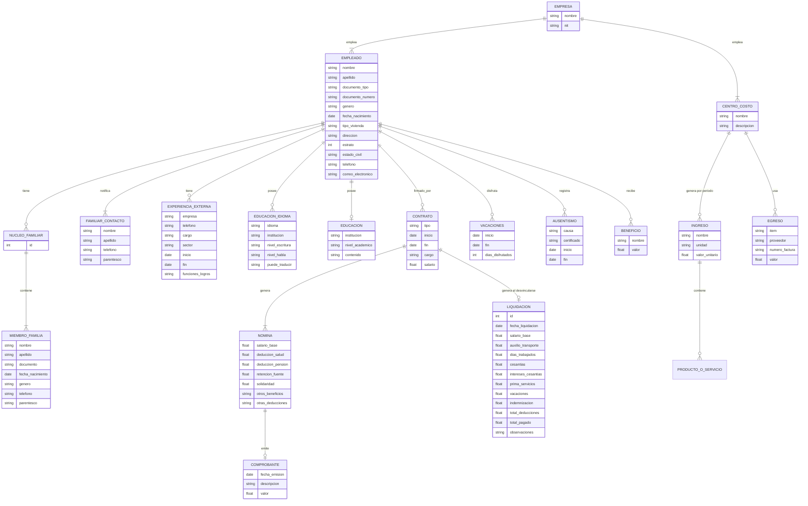

---

## title: Requerimientos Técnicos - Mi Empresa App created: 2025-07-08 author: Equipo Arquitectura de Software

## 📄 Breve descripción del sistema

"Mi Empresa App" es una solución empresarial enfocada en la gestión de personal, nómina, ausentismo, vacaciones y presupuesto financiero con centros de costo. Diseñada para cumplir obligaciones legales-labores, la aplicación busca facilitar la administración de empresas con personal vinculado con contratos de diferentes modalidades, de forma, eficiente y organizada.. Diseñada para adaptarse al contexto legal colombiano, la aplicación busca facilitar la administración de empresas con personal contratado de forma legal, eficiente y organizada.

## 📊 Funcionalidades Principales

1. Gestión de Empleados

Registro detallado de datos personales y laborales

Registro de familiar de contacto y núcleo familiar

Historial de experiencia laboral interna y externa

Registro de educación e idiomas

Registro de vehículos, certificados de altura y riesgo eléctrico

Movilidad geográfica y datos migratorios

6. Modulo Paciente y notas

7. modulo de certificacion y formatos
- carga de formatos estandarizados
- recordatorio de renovacion

2. Módulo de Contratación y Nómina

Gestión de tipos de contrato laboral (OPS, Obra/Labor, Término Fijo/Indefinido)

Liquidación de salario y generación de comprobantes

Deducciones, beneficios y otras obligaciones

Generación de certificados laborales

Liquidación al finalizar el vínculo laboral según ley

3. Gestión del Tiempo

Registro y cálculo de vacaciones acumuladas y disfrutadas

Reporte de personas con vacaciones vencidas

4. Ausentismo y Licencias

Registro de causas de ausentismo

Adjuntar certificados (incapacidad, prórrogas, licencias legales)

5. Finanzas y Presupuesto

Definición de ingresos por centro de costos (ej: mensualidades, eventos)

Registro de egresos por ítem, proveedor y factura

Generación de pre-facturas y trazabilidad contable

---

--- client feedback ----

manejo de redes basico
--- end ---

## ✅ Technical Requirements

### Backend

- **Runtime & Language**: Node.js with TypeScript for type safety and developer productivity
- **Framework**: Express.js – lightweight, battle-tested, minimal overhead for business logic focus
- **Database**: PostgreSQL – proven reliability, excellent JSON support, cost-effective at scale
- **ORM**: Prisma – strongly typed, auto-generated migrations, simplified data access layer
- **Authentication & Authorization**: JWT-based stateless authentication with role-based access control (RBAC) – Admin, Employee, Auditor, Operator
- **Third-party Integrations**: Phase 2 (deferred for MVP focus)

### Frontend

- **Framework**: Nuxt 4 + TypeScript – universal rendering with simplified SSR, type-safe development
- **UI Framework**: Tailwind CSS – utility-first approach reduces custom CSS debt and design inconsistencies
- **State Management**: Pinia – lightweight store library, built-in Vue 3 composition API support
- **Internationalization**: i18n via nuxt-i18n (future phase, deferred for MVP)

### DevOps & Infrastructure

- **Cloud Provider**: AWS – EC2 for application servers, RDS for managed PostgreSQL, S3 for static assets/document storage
- **CI/CD Pipeline**: GitHub Actions + Docker containerization for reproducible, scalable deployments
- **Logging & Monitoring**: Open-source solution (ELK Stack or similar) on dedicated cost-optimized VM instead of AWS CloudWatch to reduce licensing costs
- **Security**: HTTPS/TLS, OWASP Top 10 compliance, Content Security Policy (CSP) headers, XSS/CSRF token protection

---

## 📚 Requerimientos No Técnicos

- Soporte a navegadores modernos (Chrome, Safari, Edge)
- Usabilidad: Diseño accesible y responsive (mobile-first)
- Multitenencia: posibilidad de administrar múltiples empresas en una sola instancia (future phase)

---

## 📌 Diagrama de Entidades (Resumen Simplificado)

---

## 🌐 Consideraciones Legales Colombianas

### Contratación y Nómina

- **Tipos de contrato válidos**: OPS, Término fijo, indefinido, obra o labor. Cada uno tiene distintas implicaciones para liquidación y aportes.
- **Aportes obligatorios**: Salud (12.5%), Pensión (16%), ARL, Caja de compensación.
- **Retención en la fuente**: Debe calcularse automáticamente según tablas de la DIAN.
- **Liquidaciones**: Cálculo conforme al Código Sustantivo del Trabajo (Cesantías, intereses, prima y vacaciones).

### Protección de Datos

- La información personal y laboral del empleado está protegida bajo la Ley 1581/2012 de protección de datos.
- Se debe solicitar autorización para el tratamiento de datos personales.

---

## 🛠️ Siguientes pasos

- Validación de historias de usuario con el PO
- Definir MVP para la primera versión: Módulo de Empleados + Nómina + Finanzas
- Crear prototipo funcional (Figma)
- Estimación de esfuerzo y roadmap

---

## ✉️ Notas Adicionales

- Se debe permitir exportar información en PDF y Excel
- Requiere generador de certificados laborales y reportes de ausentismo
- El sistema debe tener auditoría de cambios (bitácora)

---

