# Mi Empresa App - Database Schema v2

**Version:** 2.0
**Last Updated:** 2026-01-14
**Source:** Campos de datos v1.md

This diagram represents the complete database schema for Mi Empresa App, including Employee Management, Client Management with Fichas/Documentos module, Payroll, and Financial modules.

---

## Complete Entity Relationship Diagram

```mermaid
erDiagram
    %% ========================================
    %% EMPLOYEE MANAGEMENT MODULE
    %% ========================================

    EMPLEADO {
        int empleado_id PK
        string nombre
        string apellido
        string tipo_documento "CC, CE, Pasaporte"
        string numero_documento UK
        boolean permiso_trabajo
        string genero
        date fecha_nacimiento
        string tipo_vivienda "casa, apartamento, lote"
        string direccion
        int estrato_socioeconomico
        string estado_civil
        string telefono
        string email
        string estado "Activo, Inactivo"
        date fecha_registro
    }

    NUCLEO_FAMILIAR {
        int nucleo_id PK
        int empleado_id FK
        string nombre
        string apellido
        string tipo_documento "Registro Civil, TI, CC, CE"
        string numero_documento
        date fecha_nacimiento
        string genero
        string telefono
        string parentesco "padre, madre, hijo, esposo"
    }

    CONTACTO_EMERGENCIA_EMPLEADO {
        int contacto_id PK
        int empleado_id FK
        string nombre
        string apellido
        string telefono
        string parentesco
    }

    CARGO {
        int cargo_id PK
        int empleado_id FK
        date fecha_ingreso
        date fecha_terminacion
        string nombre_cargo
        string ubicacion "SEDE o dirección física"
    }

    EXPERIENCIA_LABORAL_EXTERNA {
        int experiencia_id PK
        int empleado_id FK
        string empresa
        string telefono_empresa
        string cargo
        string sector
        date periodo_inicio
        date periodo_fin
        text funciones_logros
    }

    EDUCACION_IDIOMAS {
        int idioma_id PK
        int empleado_id FK
        string institucion
        string nivel_escritura
        string nivel_habla
        boolean capacidad_traducir
    }

    VEHICULO {
        int vehiculo_id PK
        int empleado_id FK
        string tipo_vehiculo
        string placas
        string tipo_licencia
        string numero_licencia
    }

    CERTIFICADO_ALTURAS {
        int cert_altura_id PK
        int empleado_id FK
        date fecha_expedicion
        date fecha_vencimiento
    }

    CERTIFICADO_RIESGO_ELECTRICO {
        int cert_electrico_id PK
        int empleado_id FK
        date fecha_expedicion
        date fecha_vencimiento
    }

    DATOS_MIGRACION {
        int migracion_id PK
        int empleado_id FK
        string numero_pasaporte
        date pasaporte_expedicion
        date pasaporte_vencimiento
        string numero_visa
        date visa_expedicion
        date visa_vencimiento
    }

    %% ========================================
    %% PAYROLL MODULE
    %% ========================================

    NOMINA {
        int nomina_id PK
        int empleado_id FK
        string tipo_contrato "OPS, Obra o labor, Término fijo, Término indefinido"
        date fecha_inicio
        date fecha_terminacion
        string cargo
        decimal salario
        date fecha_pago
        string periodo "mensual, quincenal"
    }

    DEDUCCION_SALARIO {
        int deduccion_id PK
        int nomina_id FK
        string tipo "salud, pension, retencion_fuente, solidaridad"
        decimal valor
        text descripcion
    }

    BENEFICIO {
        int beneficio_id PK
        int nomina_id FK
        string nombre_beneficio
        decimal valor
        text descripcion
    }

    COMPROBANTE_PAGO {
        int comprobante_id PK
        int nomina_id FK
        date fecha_generacion
        date periodo_inicio
        date periodo_fin
        decimal total_devengado
        decimal total_deducciones
        decimal neto_pagar
        string archivo_pdf
    }

    %% ========================================
    %% TIME MANAGEMENT MODULE
    %% ========================================

    GESTION_TIEMPO_VACACIONES {
        int vacacion_id PK
        int empleado_id FK
        date fecha_inicio
        date fecha_finalizacion
        int dias_tomados "días hábiles"
        string estado "Aprobado, Pendiente, Rechazado"
        date fecha_solicitud
    }

    AUSENTISMO {
        int ausentismo_id PK
        int empleado_id FK
        string causa "incapacidad, prorroga, permiso, licencia_no_remunerada, licencia_legal"
        string tipo_licencia "maternidad, paternidad, luto"
        date fecha_inicio
        date fecha_fin
        string certificado_adjunto
        text observaciones
    }

    %% ========================================
    %% CLIENT MANAGEMENT MODULE
    %% ========================================

    CLIENTE {
        int cliente_id PK
        string nombre
        string tipo_documento "CC, CE, Pasaporte, Registro Civil"
        string numero_documento UK
        date fecha_nacimiento
        int edad "auto-calculado"
        string genero
        string telefono
        string email
        date fecha_ingreso
        string estado "Activo, Inactivo"
        text notas
        string informacion_seguro "opcional"
        text observaciones_especiales "opcional"
    }

    CONTACTO_EMERGENCIA_CLIENTE {
        int contacto_id PK
        int cliente_id FK
        string nombre
        string telefono
        string parentesco
    }

    %% ========================================
    %% FICHAS Y DOCUMENTOS SUB-MODULE
    %% ========================================

    INSTRUMENTO {
        int instrumento_id PK
        string nombre_instrumento
        string codigo "opcional"
        text descripcion
        string tipo "Valoración, Nutrición, Matrícula, Admisión"
        string periodicidad "Única, Anual, Mensual, Trimestral, Semestral"
        string roles_permitidos "multi-select"
        string estado "Activo, Inactivo"
        string plantilla_archivo
        date fecha_creacion
        int creado_por FK "user_id"
        date fecha_modificacion
        int modificado_por FK "user_id"
        string version_plantilla
    }

    REGISTRO_FICHA_COMPLETADA {
        int registro_id PK
        int cliente_id FK
        int instrumento_id FK
        string estado "Completado, Pendiente, Vencido"
        date fecha_completado
        string version_registro "v1, v2, v3"
        int responsable FK "user_id"
        string archivo_completado "any file type"
        text notas_observaciones
        date fecha_vencimiento "auto-calculado"
        string alerta_vencimiento "30, 15, 7 días antes"
        date fecha_creacion_registro
    }

    NOTA_CLIENTE {
        int nota_id PK
        int cliente_id FK
        int registro_ficha_id FK "opcional, puede ser NULL"
        string tipo_nota "Positiva, Negativa, Neutral, Alerta"
        datetime fecha
        int autor FK "user_id"
        text contenido
        string prioridad "Alta, Media, Baja"
        string visible_para "Todos, Solo Médicos, Solo Admin"
    }

    %% ========================================
    %% FINANCE MODULE
    %% ========================================

    CENTRO_COSTOS {
        int centro_id PK
        string nombre
        string tipo "Ingresos, Egresos"
        text descripcion
    }

    PRODUCTO_SERVICIO {
        int producto_id PK
        int centro_costos_id FK
        string codigo_interno
        string nombre
        decimal precio_total
        string nombre_impuesto
        decimal porcentaje_impuesto
        decimal precio_base "auto-calculado"
        decimal costo_unitario
        int cantidad_inicial
        string unidad_medida
        text descripcion
        string referencia
        string cuenta_ingresos
        string cuenta_inventario
        string cuenta_costo_venta
        boolean venta_negativo
    }

    EGRESO {
        int egreso_id PK
        int centro_costos_id FK
        string codigo_interno
        string item
        text notas
        string proveedor_nombre
        string proveedor_tipo_doc "NIT"
        string proveedor_numero
        decimal valor
        string numero_factura
        date fecha
    }

    PREFACTURA {
        int prefactura_id PK
        int cliente_id FK
        int producto_servicio_id FK
        date fecha_generacion
        decimal subtotal
        decimal impuestos
        decimal total
        string estado "Borrador, Enviado, Pagado"
    }

    %% ========================================
    %% RELATIONSHIPS
    %% ========================================

    %% Employee Module Relationships
    EMPLEADO ||--o{ NUCLEO_FAMILIAR : "tiene"
    EMPLEADO ||--o| CONTACTO_EMERGENCIA_EMPLEADO : "tiene"
    EMPLEADO ||--o{ CARGO : "tiene historial"
    EMPLEADO ||--o{ EXPERIENCIA_LABORAL_EXTERNA : "tiene"
    EMPLEADO ||--o{ EDUCACION_IDIOMAS : "domina"
    EMPLEADO ||--o{ VEHICULO : "posee"
    EMPLEADO ||--o| CERTIFICADO_ALTURAS : "tiene"
    EMPLEADO ||--o| CERTIFICADO_RIESGO_ELECTRICO : "tiene"
    EMPLEADO ||--o| DATOS_MIGRACION : "tiene"

    %% Payroll Module Relationships
    EMPLEADO ||--o{ NOMINA : "recibe"
    NOMINA ||--o{ DEDUCCION_SALARIO : "tiene"
    NOMINA ||--o{ BENEFICIO : "incluye"
    NOMINA ||--o{ COMPROBANTE_PAGO : "genera"

    %% Time Management Relationships
    EMPLEADO ||--o{ GESTION_TIEMPO_VACACIONES : "solicita"
    EMPLEADO ||--o{ AUSENTISMO : "registra"

    %% Client Module Relationships
    CLIENTE ||--o| CONTACTO_EMERGENCIA_CLIENTE : "tiene"

    %% Fichas y Documentos Module Relationships
    CLIENTE ||--o{ REGISTRO_FICHA_COMPLETADA : "tiene registros"
    INSTRUMENTO ||--o{ REGISTRO_FICHA_COMPLETADA : "se completa en"
    CLIENTE ||--o{ NOTA_CLIENTE : "tiene notas"
    REGISTRO_FICHA_COMPLETADA ||--o{ NOTA_CLIENTE : "puede tener notas"

    %% Finance Module Relationships
    CENTRO_COSTOS ||--o{ PRODUCTO_SERVICIO : "contiene"
    CENTRO_COSTOS ||--o{ EGRESO : "registra"
    CLIENTE ||--o{ PREFACTURA : "recibe"
    PRODUCTO_SERVICIO ||--o{ PREFACTURA : "se incluye en"
```



---

## Module Overview

### 1. **Employee Management Module**
- **Core Entity:** `EMPLEADO`
- **Related Entities:** 10 entities
- **Key Features:**
  - Personal information and documentation
  - Family and emergency contacts
  - Position history and external experience
  - Education and language skills
  - Vehicle and special certifications
  - Migration data

### 2. **Payroll Module**
- **Core Entity:** `NOMINA`
- **Related Entities:** 3 entities
- **Key Features:**
  - Contract types and salary management
  - Deductions (health, pension, withholding)
  - Benefits and bonuses
  - Payment voucher generation

### 3. **Time Management Module**
- **Core Entities:** `GESTION_TIEMPO_VACACIONES`, `AUSENTISMO`
- **Key Features:**
  - Vacation tracking and approval
  - Absence management with legal certifications
  - Medical leave and personal licenses

### 4. **Client Management Module**
- **Core Entity:** `CLIENTE`
- **Sub-module:** Fichas y Documentos
- **Related Entities:** 4 entities
- **Key Features:**
  - Basic client contact information
  - Customizable entity naming (Cliente/Paciente/Estudiante)
  - Emergency contact management
  - Notes with classification and privacy controls

### 5. **Fichas y Documentos Sub-Module**
- **Core Entities:** `INSTRUMENTO`, `REGISTRO_FICHA_COMPLETADA`, `NOTA_CLIENTE`
- **Key Features:**
  - Template-based document/form management
  - Periodic evaluation tracking with versioning
  - Automated expiration alerts
  - Role-based access control
  - Notes linked to specific forms or general client

### 6. **Finance Module**
- **Core Entities:** `CENTRO_COSTOS`, `PRODUCTO_SERVICIO`, `EGRESO`, `PREFACTURA`
- **Key Features:**
  - Cost center management (income/expenses)
  - Product/service catalog with tax handling
  - Expense tracking with supplier information
  - Pre-invoice generation

---

## Key Design Patterns

### 1. **Versioning System**
- `INSTRUMENTO.version_plantilla` - Template versions (v1.0, v1.1, v2.0)
- `REGISTRO_FICHA_COMPLETADA.version_registro` - Multiple completions of same form (v1, v2, v3)

### 2. **Audit Trail**
- Metadata fields: `fecha_creacion`, `creado_por`, `fecha_modificacion`, `modificado_por`
- Applies to: `INSTRUMENTO`, `REGISTRO_FICHA_COMPLETADA`

### 3. **Flexible File Handling**
- `INSTRUMENTO.plantilla_archivo` - Template file (any format)
- `REGISTRO_FICHA_COMPLETADA.archivo_completado` - Completed file (Excel, PDF, Word, images)

### 4. **Alert System**
- `REGISTRO_FICHA_COMPLETADA.fecha_vencimiento` - Auto-calculated based on periodicidad
- `REGISTRO_FICHA_COMPLETADA.alerta_vencimiento` - Configurable reminder periods

### 5. **Privacy Controls**
- `NOTA_CLIENTE.visible_para` - Role-based visibility (Todos, Solo Médicos, Solo Admin)

### 6. **Optional Relationships**
- `NOTA_CLIENTE.registro_ficha_id` - Notes can be general or linked to specific form completion

---

## Calculated Fields & Views

### Client Statistics (Auto-calculated for UI display)
```sql
-- Example query for calculating client stats
SELECT
    c.cliente_id,
    COUNT(DISTINCT rfc.registro_id) as total_fichas_completadas,
    COUNT(DISTINCT CASE WHEN rfc.estado = 'Pendiente' THEN rfc.registro_id END) as fichas_pendientes,
    COUNT(DISTINCT CASE WHEN rfc.estado = 'Vencido' THEN rfc.registro_id END) as fichas_vencidas,
    DATEDIFF(NOW(), MAX(nc.fecha)) as dias_ultima_nota,
    COUNT(DISTINCT CASE WHEN nc.tipo_nota = 'Positiva' THEN nc.nota_id END) as notas_positivas,
    COUNT(DISTINCT CASE WHEN nc.tipo_nota = 'Negativa' THEN nc.nota_id END) as notas_negativas,
    COUNT(DISTINCT CASE WHEN rfc.fecha_vencimiento BETWEEN NOW() AND DATE_ADD(NOW(), INTERVAL 30 DAY) THEN rfc.registro_id END) as alertas_activas
FROM CLIENTE c
LEFT JOIN REGISTRO_FICHA_COMPLETADA rfc ON c.cliente_id = rfc.cliente_id
LEFT JOIN NOTA_CLIENTE nc ON c.cliente_id = nc.cliente_id
GROUP BY c.cliente_id;
```

---

## Entity Count Summary

| Module | Entities | Description |
|--------|----------|-------------|
| Employee Management | 10 | Core employee data and related information |
| Payroll | 4 | Salary, deductions, benefits, vouchers |
| Time Management | 2 | Vacations and absences |
| Client Management | 2 | Basic client info and emergency contacts |
| Fichas y Documentos | 3 | Document templates, completions, notes |
| Finance | 4 | Cost centers, products, expenses, invoices |
| **TOTAL** | **25** | Complete system entities |

---

## Notes

1. **Foreign Keys (FK):**
   - `user_id` references assume a separate `USER` or `USUARIO` table (not shown in this schema)
   - All `*_id` fields marked as FK reference their respective parent tables

2. **Unique Keys (UK):**
   - `EMPLEADO.numero_documento` - Ensures no duplicate employee documents
   - `CLIENTE.numero_documento` - Ensures no duplicate client documents

3. **Auto-calculated Fields:**
   - `CLIENTE.edad` - Calculated from `fecha_nacimiento`
   - `REGISTRO_FICHA_COMPLETADA.fecha_vencimiento` - Calculated from `fecha_completado` + `INSTRUMENTO.periodicidad`

4. **Multi-select Fields:**
   - `INSTRUMENTO.roles_permitidos` - Stored as comma-separated string or JSON array

5. **Customizable Display Names:**
   - `CLIENTE` entity can be displayed as "Pacientes", "Estudiantes", etc. based on business context

---

**Generated from:** Campos de datos v1.md
**Diagram Tool:** Mermaid ERD
**Schema Version:** 2.0
